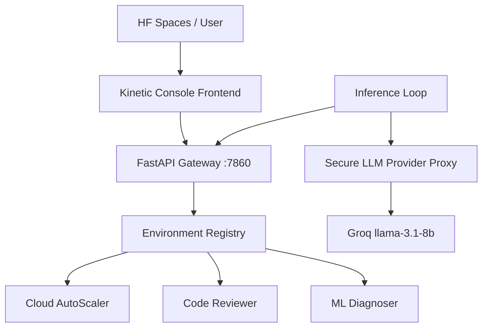

# 🤖 Anigrevity Cloud Suite
### High-Fidelity RL & LLM Evaluation Framework for Enterprise Agentic Workflows

[](https://gymnasium.farama.org/)
[](https://fastapi.tiangolo.com)
[]()
[]()

**Anigrevity** is a production-grade evaluation suite for benchmarking and deploying LLM-based autonomous controllers. It provides a synchronized, multi-agent environment hub across infrastructure management, security auditing, and ML failure diagnosis.

---

## 🏗️ System Architecture

The suite is designed with a strict separation of concerns, ensuring that the frontend monitoring, backend simulation, and LLM inference loop remain decoupled and compliant.



---

## 💎 Enterprise Compliance & Hardening

We have implemented rigorous boundary controls for production-ready model evaluations:

*   **Fixed Reward Boundary**: All internal rewards and end-of-episode task scores are hard-clamped to the **(0.01, 0.99)** interval. This eliminates boundary-condition failures seen in standard evaluations.
*   **Synchronized Logging Protocol**: Standardized stdout logging for automated parsers:
    *   `[START] task={name} env={suite} model={model}`
    *   `[STEP] step={n} action={...} reward={r} done={b}`
    *   `[END] task={name} score={s.2f} steps={n}`
*   **LLM Proxy Isolation**: All actions are generated via the mandatory `API_BASE_URL` using authorized `HF_TOKEN` credentials.

---

## 📊 Environment Catalog

### 1. Cloud AutoScaler (`autoscaling_hard`)
Autonomous infrastructure management.
- **Challenge**: Balance 70% cluster utilization against sub-50ms latency amidst random traffic spikes.
- **Action Space**: `0: Hold`, `1: Scale Up`, `2: Scale Down`.
- **Metrics**: Latency (ms), Cost (server-steps), Reliability.

### 2. Code Review Auditor (`code_review_hard`)
Automated security reasoning.
- **Challenge**: Scan multi-file PR diffs for SQLi, XSS, and broken access controls.
- **Action Space**: `APPROVE`, `REJECT`, `CHANGES`, `COMMENT`.
- **Precision**: High-confidence blocking of critical RCE vulnerabilities.

### 3. ML Failure Diagnosis (`wdif_hard`)
Deep-tier technical debugging.
- **Challenge**: Investigate training logs to distinguish between exploding gradients, dying ReLUs, and underfitting.
- **Flow**: Systematic inspection of logs, configs, and gradient norms.

---

## 🎨 Kinetic Console Dashboard
Included in the suite is a high-fidelity monitoring frontend (`index.html`).

*   **Real-time Telemetry**: Chart.js integration for visual reward tracking.
*   **System Terminal**: Multi-color log streaming for direct debugging.
*   **Interactive Controls**: Manual override buttons for state-injection testing.

---

## 🚀 Deployment & Usage

### Local Containerization
```bash
# Build and serve via Docker
docker build -t anigrevity-suite .
docker run -p 7860:7860 anigrevity-suite
```

### Integrated Inference
To execute a compliant evaluation loop:
```bash
# Set credentials
set HF_TOKEN=your_huggingface_token

# Run inference
python inference.py
```

### Pre-Deployment Verification
```bash
# Run the Meta OpenEnv pre-check
python main.py
```

---
*© 2026 Anigrevity Inc. All rights reserved.* ☁️
